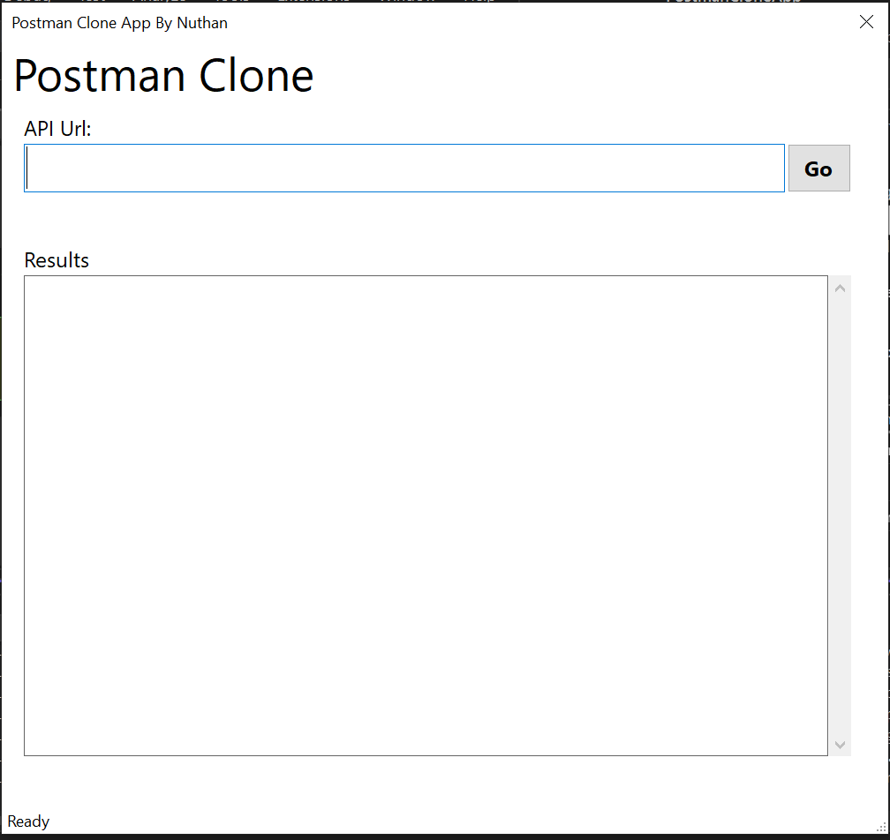

# About Postman Clone App
Objective of this project is to avoid using external tool like postman for simple api testing.

## What are we going to learn?
- How to use visual studio IDE effectively to make your life simply and productive using short cuts?
- Understand the importance of GIT and GITHUB
- Learn how to resolve the errors while designing your app. Here, you can find all the errors and their solutions for that.
- We develop using this windows form using .NET 8
- Use .NET 8 and latest C# version features if possible

## Concepts you learn:
- Github and GIT
- HttpClient
- Json
- Windows Forms
- .NET 8
- C#

## To use this app
- Clone/Dowload this repo into your local system Or go to release section and under bin download the executable file.
- Once the application launches application looks like below designs.
- At this momement this application supports only GET API requests. so you can try to hit any api URL and see the response.

## Postman Windows Form Designs
### Initial Design 


### Sample UI with JSON Response in result window with unreadable format
```
var response = await client.GetAsync(url);

if(response.IsSuccessStatusCode)
{
    string json = await response.Content.ReadAsStringAsync();
    return json;
}
else
{
    return $"Error: {response.StatusCode}";
}
```
### Response for the above code


### Sample UI with JSON Response in result window with indented/readable format
```
var response = await client.GetAsync(url);

if (response.IsSuccessStatusCode)
{
    string json = await response.Content.ReadAsStringAsync();
    var jsonElement = JsonSerializer.Deserialize<JsonElement>(json);
    var jsonPretty = JsonSerializer.Serialize(jsonElement,
        new JsonSerializerOptions { WriteIndented = true });
    return jsonPretty;
}
else
{
    return $"Error: {response.StatusCode}";
}
```
### Response for the above code


## Upcoming Changes
* Add support for POST, PUT and DELETE functionalities
* Add API Headers
* Add Logging
* Add Dependency Injection
* Handly API Authentication
* 
## Reference:
Youtube Playlist: [@IamTimCorey](https://www.youtube.com/playlist?list=PLLWMQd6PeGY3IxROaW7Hj8KFbRPg1x7mc),
I learnt all these tips from this youtube playlist. If you are new checkit out his videos for indepth knowledge.

## Important Youtube shorts/videos:
- [Visual studio Tip 1: How to add the project reference in once clik](https://www.youtube.com/shorts/QYp3q1D9Jds)
